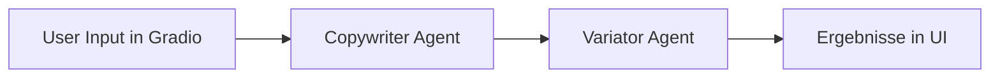

# Marketing ADK Agent

## Projektbeschreibung und Ziele
Dieses Projekt implementiert einen **AI-gestützten Marketing-Agenten** mit Google ADK und Gradio.

Ziel ist es, aus wenigen Eingaben (Produkt, Zielgruppe, Marketingziel, Keywords) automatisch:
- einen ersten Werbetext zu erzeugen,
- mehrere kanal- und stilgerechte Variationen zu erstellen,
- den Prozess für schnelle Kampagnen-Ideen im Browser nutzbar zu machen.

Der Fokus liegt auf einem klaren, pragmatischen Workflow für Content-Ideen und A/B-Testing-Startpunkte.

---

## Agenten-Architektur 
Die Anwendung verwendet eine **SequentialAgent-Architektur** mit zwei spezialisierten LLM-Agenten:

1. **Copywriter Agent**
   - erstellt den initialen Werbetext auf Basis der Nutzereingaben.
2. **Variator Agent**
   - erzeugt drei Variationen (emotional, faktenbasiert, Social-Media-kurz).

Ablaufdiagramm:



Technisch wird die Sequenz in `marketing_agent/agent.py` über `SequentialAgent` orchestriert und über `InMemoryRunner` ausgeführt.

---

## Installation und Ausführung

### Voraussetzungen
- Python **3.12+**
- API-Key für Gemini/Google GenAI

### 1) Projekt öffnen
```bash
cd marketing-adk-agent
```

### 2) Umgebung einrichten (Variante `uv`)
```bash
uv sync
```

Alternative mit `pip`:
```bash
python -m venv .venv
source .venv/bin/activate
pip install -U pip
pip install -e .
```

### 3) Umgebungsvariablen setzen
Datei `.env` im Projekt-Root anlegen/prüfen:

```env
GEMINI_API_KEY=dein_api_key
APP_NAME=marketing_agent
USER_ID=user
```

### 4) App starten
```bash
uv run app.py
```

Alternative:
```bash
python app.py
```

Danach die lokale Gradio-URL im Browser öffnen.

---

## Wichtigste Funktionen und Verwendung

### Eingaben
In der Gradio-Oberfläche:
- **Produkt / Dienstleistung** (Pflicht)
- **Zielgruppe** (Pflicht)
- **Marketingziel** (Pflicht)
- **Wichtige Keywords** (optional)

### Outputs
Nach Klick auf **„Kampagne generieren“** werden angezeigt:
- **Entwurf (Copywriter)**
- **Variationen (Variator)**

### Typischer Use Case
1. Produkt und Zielgruppe kurz beschreiben.
2. Marketingziel klar formulieren (z. B. Leads, Awareness, Conversion).
3. Entwurf als Basis nutzen.
4. Variationen für unterschiedliche Kanäle testen/adaptieren.

---

## Projektstruktur

```text
marketing-adk-agent/
├── app.py
├── pyproject.toml
├── .env
└── marketing_agent/
    ├── __init__.py
    └── agent.py
```

- `app.py`: Gradio-UI, Input-Verarbeitung, Runner-Aufruf
- `marketing_agent/agent.py`: Definition der Agenten und Pipeline
- `pyproject.toml`: Abhängigkeiten und Build-Konfiguration

---

## Herausforderungen und Lerneffekte (Reflexion)

### Herausforderungen
- **API-/Library-Kompatibilität:** Unterschiedliche Signaturen in ADK-nahen Methoden (z. B. Session-Erstellung) mussten robust abgefangen werden.
- **Asynchronität in UI-Workflows:** Zusammenspiel von async Agent-Events und synchronem UI-Callback erforderte klare Struktur, hatte persönlich Anfangs Schwierigkeiten, Texte angezeigt zu bekommen.
- **Scope-Klarheit der Pipeline:** Der initiale Aufbau mit zusätzlichem Review-Agent war funktionsreich, aber für den Ziel-Workflow unnötig komplex, ich habe das Projekt kleiner gemacht.

### Lerneffekte
- **Spezialisierte Agenten verbessern Qualität:** Trennung in Copywriting und Variation erhöht Nachvollziehbarkeit und Ergebnisqualität.
- **Weniger ist oft besser:** Das Entfernen nicht zwingender Pipeline-Schritte steigert Wartbarkeit und Geschwindigkeit.
- **Frühe UX-Integration hilft:** Mit Gradio lassen sich Agenten-Flows schnell validieren und iterativ verbessern.

---

## Hinweise
- Falls Imports in der IDE als „nicht aufgelöst“ markiert sind, ist meist die Python-Umgebung noch nicht mit den Dependencies synchronisiert.
- Bitte API-Keys niemals in öffentlichen Repositories committen; bei versehentlicher Veröffentlichung den Key sofort rotieren.
